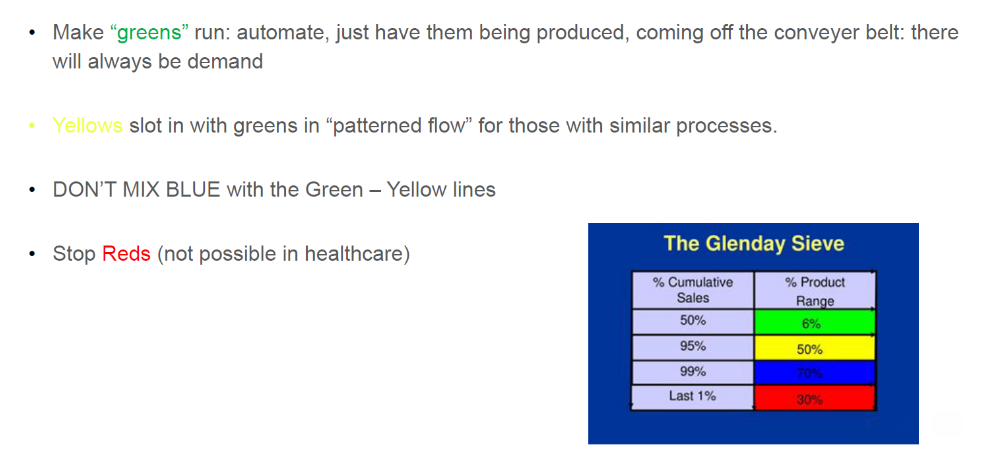
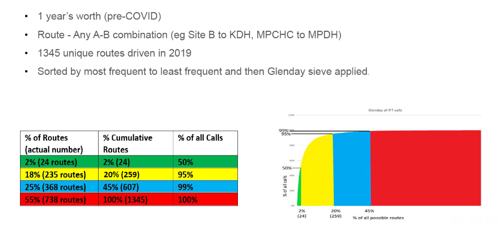
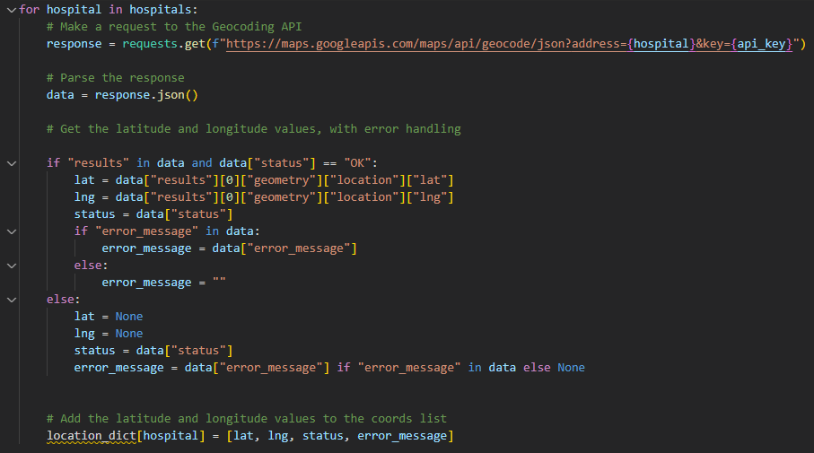
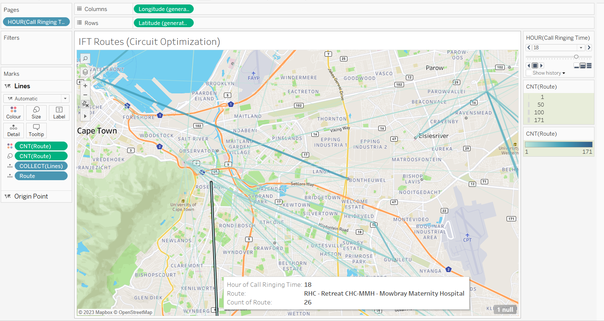
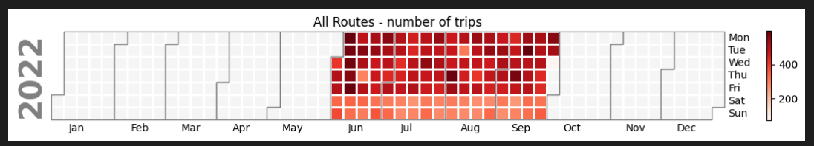
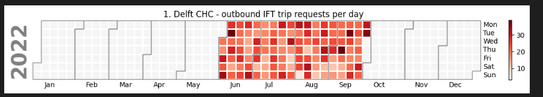
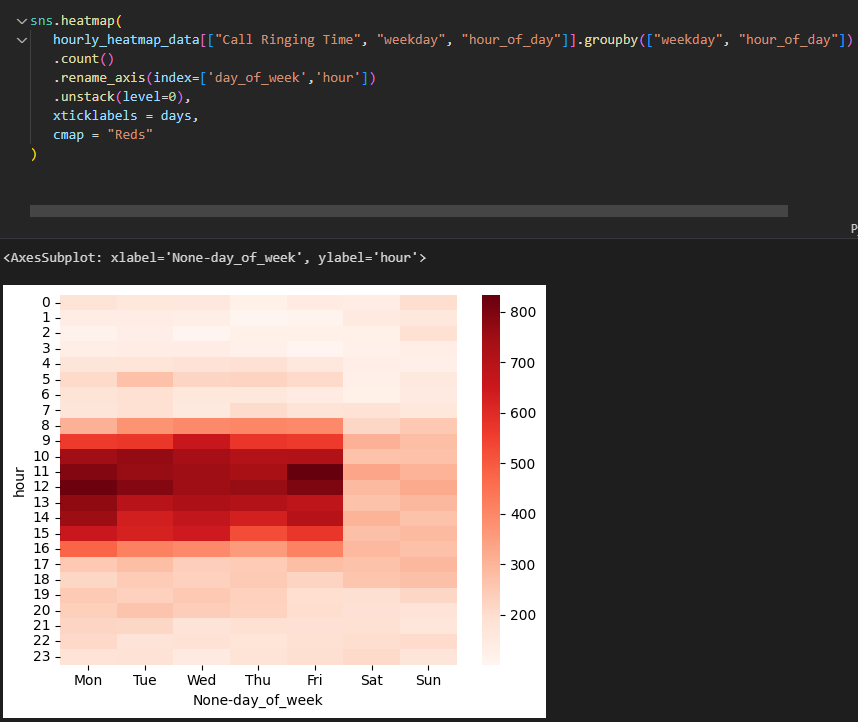
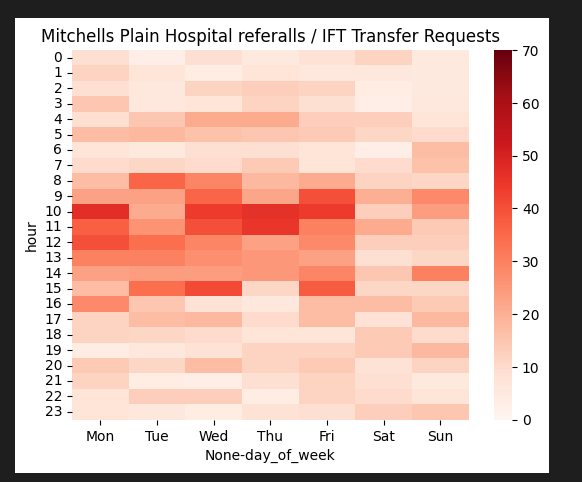
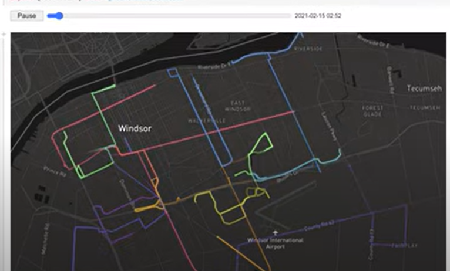

## Introducing the Glenday Sieve
The Glenday Sieve is an approach to identifying common groups of procedures, conditions or activities in healthcare. These processes are grouped by volume of activity in the first instance, helping you to identify specific areas that could be the focus of improvement efforts. Focusing improvement on a few, high volume activities can deliver significant gains for the organisation.
The approach has its origins in the Pareto principle, but has a stronger operational focus. 

In this project, we worked with the Western Cape Emergency Medical Services, to apply the principles of the Glenday Sieve to InterFacility Transfers (IFT) between one hospital and another. As predicted by Glenday, the Pareto principle applied, and a small number of routes (just 2% of all routes) made up the majority (50%+) of the workload. 

Below are the general guidelines provided by the Glenday sieve for each category of "product": 

And here is what was found w.r.t. the ambulance routes in the Western Cape: 

According to Glenday's theory then, the Green and Yellow routes are to be "automated and optimized". In this context, this meant the introduction of regular bus routes (called Circuits) running within a new division of the department called "Interfacility Transfers", with the circuits aligned to historic demand patterns in the region. This division was completely separated from the "Emergencies" division, which continued to respond dynamically to calls from the community and transfer requests from hospitals, as before. Transfer requests that fell outside of the most common routes (the Glenday Green and Yellow routes) would be integrated where easily possible within the IFT bus routes, or else handed over to the Emergencies division when needed. 

## Data / Visualization Requirements

Visualizations were requested to meet 3 core needs: 
1. To figure out the optimal circuit pathways, to best encompass the most common transfer requests from the hospitals. 
2. To optimize resource allocation across the circuits. (Ambulances + the crews that run them)
3. To help win over stakeholders in the department who struggled to understand why/how such an abstract concept might be helpful. 

## Using the Google Maps Geo-coding API to get correct co-ordinates for the hospitals
Unfortunately the full code based & the data for this project cannot yet be shared. 
Below I will instead share a few select screenshots of the core components of the code. 

There were a few mistakes in the coordinates data received from one of the EMS systems, so I chose to run the hospital names into the Google Maps Geo-coder API, to get more accurate coordinates for the analysis. 

## Analysis in Tableau 
The analysis is still very much ongoing, but for now we've got some useful map-based visualizations in Tableau that allow the team to dig into the demand patterns across the routes. 

Key elements of the above map: 
* Tableaus "Pages" functionality allows the EMS team to "step through time" to analyze how the demand patterns change over time, or (for example) what they look like, on average, on Monday's between 8am and 9am, or over weekends vs weekdays, etc. 
* The more occurences there are of a transfer request on a particular route, within the filtered time period, the thicker the line will appear on the map. 

## Analysis with Calplot
I used the Calplot python library to create heatmaps for demand patterns over time. 

Here is one of the heatmaps, showing the clear drop in demand over the weekends: 

I also printed out the same calendar format heatmap for each of the top 20 referring and receiving facilities: 

And then also used heatmaps in Seaborn to drill down into hourly patterns across the week: 

Again, this was done for the top 20 referring and receiving facilities, to identify the trends at play at each of the busiest facilities: 

## Results & Current Status 
Thanks in large part to the data gathered, the team was able to secure buy-in for the IFT vs Emergencies split, and managed to create a preliminary set of circuits and associated resource allocations. 

It's still too early to assess the full impact of the change, but it holds much promise for reducing waiting times for hospital staff who desperately need their beds freed up. 

## Some lessons in Failure
When first tackling the visualization needs for this project, I spent a good bit of time trying to visualize the ambulance trips with Deck.gl, an open source framework released by Uber, for building map visualizations and animations like [this one](https://www.youtube.com/watch?v=sOzu2PLKGs4&ab_channel=Mean%2CMedianandMoose) (see minute 53). 

Unfortunately my budding Javascript skills were not quite good enough to get deck.gl working in the amount of time available, and also proved a blocker in getting it right with [PyDeck](https://pydeck.gl/gallery/trips_layer.html). That said, I did learn a ton about API's in my efforts to make this happen, and I'm eager to revisit this after brushing up a bit on my JavaScript skills in the weeks ahead.

